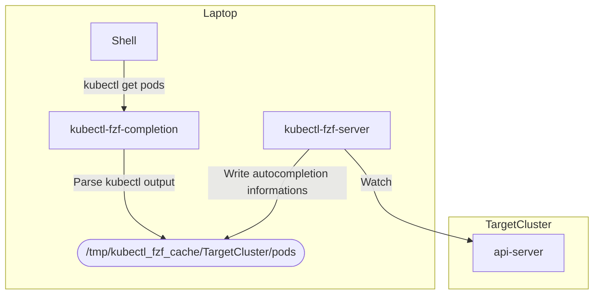
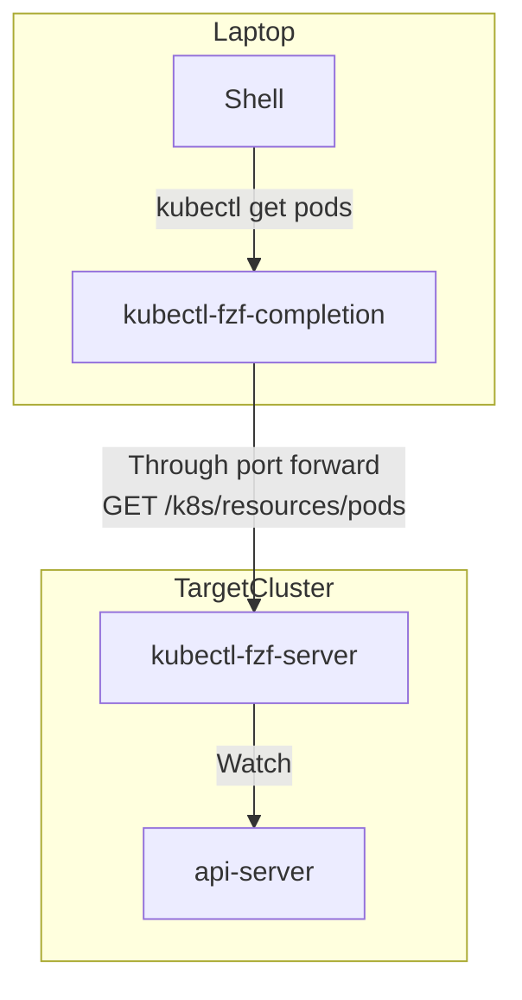

# Kubectl-fzf

kubectl-fzf provides a fast and powerful fzf autocompletion for kubectl.

[](https://asciinema.org/a/yHKY5vQ40ZaOwMQnhLfYJ5Pja?t=01)

Hello! 👋 This repository is a maintained fork of the original project at
[bonnefoa/kubectl-fzf](https://github.com/bonnefoa/kubectl-fzf/).

I attempted to reach out to the original author but haven't received a reply, so I decided to continue the work here to keep the project alive and updated.

The `main` branch is the primary branch - that's where all new development and fixes happen.

If you'd like to contribute, please make sure to open your pull requests against the `main` branch.

Tagged releases are built with GoReleaser: you get binaries for macOS/Linux (amd64/arm64) on the
[Releases page](https://github.com/rooty0/kubectl-fzf/releases) and a docker image at
`ghcr.io/rooty0/kubectl-fzf`. `go install` as described below works too.

Table of Contents
=================

* [Kubectl-fzf](#kubectl-fzf)
* [Table of Contents](#table-of-contents)
* [Features](#features)
* [Requirements](#requirements)
* [Installation](#installation)
   * [kubectl-fzf binaries](#kubectl-fzf-binaries)
   * [Shell autocompletion](#shell-autocompletion)
      * [Zsh plugins: Antigen](#zsh-plugins-antigen)
   * [kubectl-fzf-server](#kubectl-fzf-server)
      * [Install kubectl-fzf-server as a pod](#install-kubectl-fzf-server-as-a-pod)
      * [Install kubectl-fzf-server as a systemd service](#install-kubectl-fzf-server-as-a-systemd-service)
* [Usage](#usage)
   * [kubectl-fzf-server: local version](#kubectl-fzf-server-local-version)
   * [kubectl-fzf-server: pod version](#kubectl-fzf-server-pod-version)
   * [Completion](#completion)
      * [Contexts](#contexts)
      * [Configuration](#configuration)
* [Troubleshooting](#troubleshooting)
   * [Debug kubectl-fzf-completion](#debug-kubectl-fzf-completion)
   * [Debug Tab Completion](#debug-tab-completion)
   * [Debug kubectl-fzf-server](#debug-kubectl-fzf-server)

# Features

- Seamless integration with kubectl autocompletion
- Fast completion
- Label autocompletion
- Automatic namespace switch
- Completion anywhere on the line, including after a pipe
- Contexts, clusters and users completed from your kubeconfig

# Requirements

- go (minimum version 1.24)
- awk
- [fzf](https://github.com/junegunn/fzf)

# Installation

## kubectl-fzf binaries

The easiest way is `go install`:

```shell
brew install go # Ensure Go is installed first (>= 1.24). If you're not on macOS, download it here: https://go.dev/doc/install
go install github.com/rooty0/kubectl-fzf/v3/cmd/kubectl-fzf-completion@latest
go install github.com/rooty0/kubectl-fzf/v3/cmd/kubectl-fzf-server@latest
```

Or build locally from source - it's extremely easy:

```shell
git clone --depth 1 https://github.com/rooty0/kubectl-fzf.git && cd kubectl-fzf
make build # Run to generate the two binaries: kubectl-fzf-completion and kubectl-fzf-server
```

Note: Use `kubectl-fzf-server` only if you want to run the server locally

If you prefer prebuilt binaries, grab an archive for your OS/arch from the
[Releases page](https://github.com/rooty0/kubectl-fzf/releases).

Make sure `kubectl-fzf-completion` is in your `$PATH`, as this is what your shell executes (`go install` places it in `$(go env GOPATH)/bin`)

## Shell autocompletion

Source the autocompletion functions:
```
# bash version
wget https://raw.githubusercontent.com/rooty0/kubectl-fzf/main/shell/kubectl_fzf.bash -O ~/.kubectl_fzf.bash
echo "source <(kubectl completion bash)" >> ~/.bashrc
echo "source ~/.kubectl_fzf.bash" >> ~/.bashrc

# zsh version
wget https://raw.githubusercontent.com/rooty0/kubectl-fzf/main/shell/kubectl_fzf.plugin.zsh -O ~/.kubectl_fzf.plugin.zsh
echo "source <(kubectl completion zsh)" >> ~/.zshrc
echo "source ~/.kubectl_fzf.plugin.zsh" >> ~/.zshrc

# fish version
wget https://raw.githubusercontent.com/rooty0/kubectl-fzf/main/shell/kubectl_fzf.fish -O ~/.config/fish/conf.d/kubectl_fzf.fish
```

Feature notes per shell:

- zsh and fish support the full feature set: mid-line completion, completion after a
  pipe, kubectl aliases, and dropping `-A` once the picked result pins a namespace.
  They bind Tab and remember your previous Tab binding as the fallback.
- bash registers a completion for `kubectl` (and for existing kubectl aliases at
  source time). Two things bash's programmable completion cannot express are
  delegated to kubectl's own completion instead: mid-word replacement with text
  after the cursor, and removing `-A` from the line.
- bash completion strips `=` from `COMP_WORDBREAKS` so `--flag=value` arrives as
  one word; bash-completion based scripts already re-split `=` internally and are
  unaffected.

### Zsh plugins: Antigen

You can use [antigen](https://github.com/zsh-users/antigen) to load it as a zsh plugin
```shell
antigen bundle robbyrussell/oh-my-zsh plugins/docker
antigen bundle rooty0/kubectl-fzf shell/
```

## kubectl-fzf-server

### Install kubectl-fzf-server as a pod

You can deploy `kubectl-fzf-server` as a pod in your cluster.

From the [k8s directory](https://github.com/rooty0/kubectl-fzf/tree/main/k8s):
```shell
helm template --namespace myns --set image.kubectl_fzf_server.tag=v3 --set toleration=aToleration . | kubectl apply -f -
```

You can check the available image tags [here](https://github.com/rooty0/kubectl-fzf/pkgs/container/kubectl-fzf).

### Install kubectl-fzf-server as a service

You can install `kubectl-fzf-server` as a systemd unit server.

```
# Create user systemd config
mkdir -p ~/.config/systemd/user
wget https://raw.githubusercontent.com/rooty0/kubectl-fzf/main/service/systemd/kubectl_fzf_server.service -O ~/.config/systemd/user/kubectl_fzf_server.service
# Set fullpath of kubectl-fzf-server
sed -i "s#INSTALL_PATH#$GOPATH/bin#" ~/.config/systemd/user/kubectl_fzf_server.service

# Reload to pick up new service
systemctl --user daemon-reload

# Start the server
systemctl --user start kubectl_fzf_server.service

# Automatically enable it at startup
systemctl --user enable kubectl_fzf_server.service

# Get log
journalctl --user-unit=kubectl_fzf_server.service
```

To use `launchd` on **macOS** to run the `kubectl_fzf_server`, please refer to [this page](service/macos/README.md).

# Usage

## kubectl-fzf-server: local version



`kubectl-fzf-server` will watch cluster resources and keep the current state of the cluster in local files.
By default, files are written in `/tmp/kubectl_fzf_cache` (defined by `KUBECTL_FZF_CACHE`)

Advantages:
- Minimal setup needed.
- Local cache is maintained up to date.

Drawbacks:
- It can be CPU and memory intensive on big clusters.
- It also can be bandwidth intensive. The most expensive is the initial listing at startup and on error/disconnection. Big namespace can increase the probability of errors during initial listing.
- It can generate load on the kube-api servers if multiple user are running it.

To create cache files necessary for `kubectl_fzf`, just run in a tmux or a screen

```shell
kubectl-fzf-server
```

It will watch the cluster in the current context. If you switch context, `kubectl-fzf-server` will detect and start watching the new cluster.
The initial resource listing can be long on big clusters and autocompletion might need 30s+.

`connect: connection refused` or similar messages are expected if there's network issues/interruptions and `kubectl-fzf-server` will automatically reconnect.

## kubectl-fzf-server: pod version



If the pod is deployed in your cluster, the autocompletion will be fetched automatically fetched using port forward.

Advantages:
- No need to run a local `kubectl-fzf-server`
- Only a single instance of `kubectl-fzf-server` per cluster is needed, lowering the load on the `kube-api` servers.

Drawbacks:
- Resources need to be fetched remotely, this can increased the completion time. A local cache is maintained to lower this.

## Completion

Once `kubectl-fzf-server` is running, you will be able to use `kubectl_fzf` by calling the kubectl completion
```shell
# Get fzf completion on pods in the current namespace
kubectl get pod <TAB>

# Across all namespaces. Picking a pod puts back its name and namespace, and drops -A
kubectl get pod -A <TAB>

# Open fzf autocompletion on all available label
kubectl get pod -l <TAB>

# Open fzf autocompletion on all available field-selector. Usually much faster to list all pods running on an host compared to kubectl describe node.
kubectl get pod --field-selector <TAB>

# This will fallback to the normal kubectl completion (if sourced) 
kubectl <TAB>
```

### Contexts

A `--context` on the command line is honoured: `kubectl get pods --context other <TAB>` completes
from that context and defaults to its namespace, not the current one.

`kubectl-fzf-server` caches only the context it watches, which is the current one. A context it has
never watched has no cache, so completion for it falls back to kubectl rather than answer from the
wrong cluster. Switching to that context once, while the server runs, caches it for later use.

### Configuration

By default, the local port used for the port-forward is `18080`. You can override it through an environment variable:
```
KUBECTL_FZF_PORT_FORWARD_LOCAL_PORT=8081
```

You can override FZF arguments using an environment variable:
```
KUBECTL_FZF_ARGS="-1 --header-lines=2 --layout reverse --exact --no-hscroll --no-sort --cycle"
```

# Troubleshooting

## Debug kubectl-fzf-completion

Build and test a completion with debug logs:
```
go build ./cmd/kubectl-fzf-completion && KUBECTL_FZF_LOG_LEVEL=debug ./kubectl-fzf-completion k8s_completion 'get pods '  
```

Force Tab completion to use the completion binary in the current directory:
```
export KUBECTL_FZF_COMPLETION_BIN=./kubectl-fzf-completion
```

## Debug Tab Completion

To debug Tab completion, you can activate the shell debug logs:
```
export KUBECTL_FZF_COMP_DEBUG_FILE=/tmp/debug
```

Check that the completion function is correctly sourced:
```
type kubectl_fzf_completion
kubectl_fzf_completion is a shell function from /home/bonnefoa/.antigen/bundles/kubectl-fzf-main/shell/kubectl_fzf.plugin.zsh
```

In fish, check the Tab binding instead:
```
bind \t
bind \t __kubectl_fzf_completion
```

Use zsh completion debug:
```
kubectl get pods <C-X>?
Trace output left in /tmp/zsh497886kubectl1 (up-history to view)
```

## Debug kubectl-fzf-server

To launch kubectl-fzf-server with debug logs
```shell
kubectl-fzf-server --log-level debug
```
